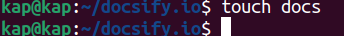
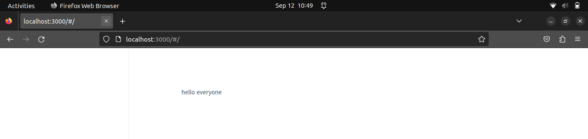
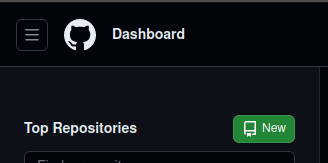
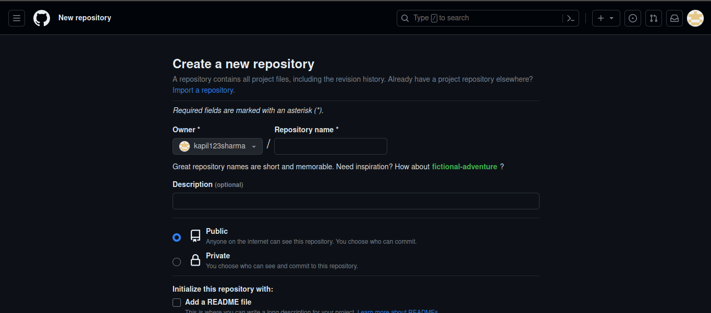
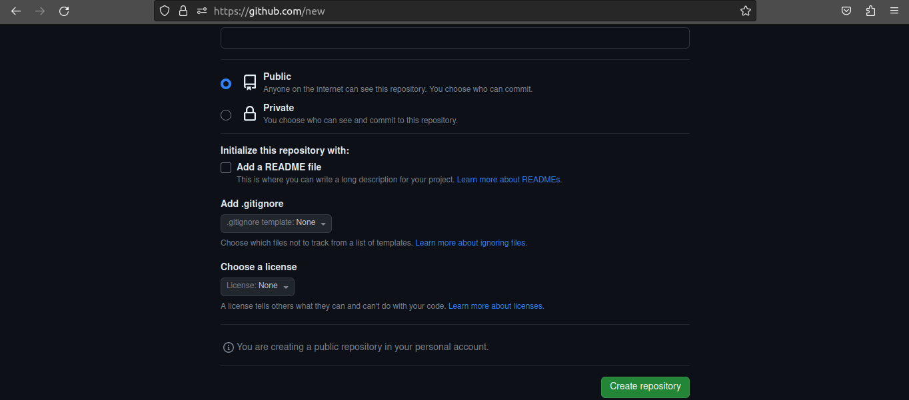

# Docsify Setup in Podman and Integration with GitHub

## Requirements

- **Docsify**: A lightweight, flexible, and easy-to-set-up documentation generator that turns Markdown documentation into a website.
- **Linux Distribution**: Ubuntu 20.04.6 LTS
- **Prerequisite Tools**:
  - **Podman**: A tool to run and manage containers on your computer.
  - **GitHub**: An online software development platform for storing, tracking, and collaborating on software projects.

## Setup Instructions

### Step 1: Install Podman

First, update and upgrade your system using the following commands:

<!DOCTYPE html>
<html>
<head>
    <title>Copy Code Example</title>
</head>
<body>
    <button onclick="copyCommand()">Copy Command</button>
    <pre><code id="commandCode">sudo apt update</code></pre>

</body>
</html>


<!DOCTYPE html>
<html>
<head>
    <title>Copy Code Example</title>
</head>
<body>
    <button onclick="copyCommand()">Copy Command</button>
    <pre><code id="commandCode">sudo apt upgrade</code></pre>

</body>
</html>


"Next, you can use the following command to install Podman:"

<!DOCTYPE html>
<html>
<head>
    <title>Copy Code Example</title>
</head>
<body>
    <button onclick="copyCommand()">Copy Command</button>
    <pre><code id="commandCode">sudo apt install -y podman</code></pre>

</body>
</html>


- `sudo`: Superuser do.
- `apt`: This stands for "Advanced Package Tool." `apt` is used to install, update, and manage software packages on your system.

- `-y`: Automatically confirms the installation without asking for user input.
- `podman`: It is the name of the package you want to install.

### Step-2:- Create directory
<!DOCTYPE html>
<html>
<head>
    <title>Copy Code Example</title>
</head>
<body>
    <button onclick="copyCommand()">Copy Command</button>
    <pre><code id="commandCode">mkdir docs</code></pre>

</body>
</html>
- The `mkdir` command is used to create a new directory named `docs`.

### Step-3:- Create Dockerfile
<!DOCTYPE html>
<html>
<head>
    <title>Copy Code Example</title>
</head>
<body>
    <button onclick="copyCommand()">Copy Command</button>
    <pre><code id="commandCode">vim Dockerfile</code></pre>

</body>
</html>
- `vim`: Used for creating and editing files.
- `Dockerfile`: The name of the file.

Add the following details to the Dockerfile:

```bash
FROM node:latest
LABEL description="A demo Dockerfile for building Docsify."
WORKDIR /docs
RUN npm install -g docsify-cli@latest
EXPOSE 3000/tcp
CMD ["docsify", "serve", "."]
```
### Step-4:-Create index.html

<!DOCTYPE html>
<html>
<head>
    <title>Copy Code Example</title>
</head>
<body>
    <button onclick="copyCommand()">Copy Command</button>
    <pre><code id="commandCode">vim index.html</code></pre>

</body>
</html>

Add details to the HTML file:

```bash

<!-- index.html -->
<!DOCTYPE html>
<html>
<head>
<meta http-equiv="X-UA-Compatible" content="IE=edge,chrome=1" />
<meta name="viewport" content="width=device-width,initial-scale=1" />
<meta charset="UTF-8" />
<link
rel="stylesheet"
href="//cdn.jsdelivr.net/npm/docsify@4/themes/vue.css"
/>
</head>
<body>
<div id="app"></div>
<script>
window.$docsify = {
//...
};
</script>
<script src="//cdn.jsdelivr.net/npm/docsify@4"></script>
</body>
</html>


```
### Step 5: Create a new file in Markdown format.
<!DOCTYPE html>
<html>
<head>
    <title>Copy Code Example</title>
</head>
<body>
    <button onclick="copyCommand()">Copy Command</button>
    <pre><code id="commandCode">touch README.md</code></pre>

</body>
</html>

- `touch`: Used for creating a new file.
- To list alIt lists the contents of files and directories.l files, you can use the following Linux shell command:
- `ls`: It lists the contents of files and directories.
 

 
 ### Step-6:- Build docker image.

 <!DOCTYPE html>
<html>
<head>
    <title>Copy Code Example</title>
</head>
<body>
    <button onclick="copyCommand()">Copy Command</button>
    <pre><code id="commandCode">podman build -f Dockerfile -t docsify/demo</code></pre>

</body>
</html>

- `podman build`: Initiates the container image building process, which means starting the procedure to create a new container image.
- `-f`: Stands for "file."
- `Dockerfile`: Specifies the name of the Dockerfile that should be used for the container image build.
- `-t`: Stands for "tag."
- `docsify`: This is the name for the image.
- `/`: It is used as a path separator in the file and directory path.
- `demo`: This is the tag for the image.
- `This command is used to manage container images in Podman.


### Step-7:-Run podman.
Create a podman container for docsify.

 <!DOCTYPE html>
<html>
<head>
    <title>Copy Code Example</title>
</head>
<body>
    <button onclick="copyCommand()">Copy Command</button>
    <pre><code id="commandCode">podman run -d -p 3000:3000 -v /home/kap/Docsify:/docs localhost/docsify/demo
</code></pre>

</body>
</html>

This command runs a container based on the `docsify/demo` image.

- `podman run`: This command is used to start and run a container, in this case, from the `docsify/demo` image.
- `-d` (detach mode): This option allows the container to run in the background. It's useful when users don't want to see the container's output in the terminal.
- `-p` (port forwarding): This option enables port forwarding between the container and the host system, allowing services within the container to be accessed from outside.
- `-v`: This option indicates volume mounting, allowing you to share files and directories between your host system and the container.


 <!DOCTYPE html>
<html>
<head>
    <title>Copy Code Example</title>
</head>
<body>
    <button onclick="copyCommand()">Copy Command</button>
    <pre><code id="commandCode">podman ps -a
</code></pre>

</body>
</html>

This command is used to see all containers on your system, both running and stopped.


### Step-8:- Preview Output.



<hr>

## Github Configuration:-

### step 1 :- Create Repository in Github.

- Make a new repository with public account.

- Click the 'new' sign in the top left corner and select 'New repository' to create a new repository.



<hr>

- Fill in the repository name, description, and other settings according to your preferences.




<hr>
- And click on create repository.


### Step-2:-Clone the repository.

 <!DOCTYPE html>
<html>
<head>
    <title>Copy Code Example</title>
</head>
<body>
    <button onclick="copyCommand()">Copy Command</button>
    <pre><code id="commandCode">git clone git@github.com:kapil123sharma/docsify.io.git
</code></pre>

</body>
</html>

- git clone : It is the Git command used to create a copy of a Git repository.
- git@github.com:kapil123sharma/docsify.io.git : It is the URL of the remote Git repository you want to clone.

### Step-3:- Integrate with Github.

- By following these commands:
```bash

# git init
# git add .
# git commit -m "first commit"
# git branch -M master
# git remote add origin https://github.com/kapil123sharma/docsify.io.git
# git push -u origin master
```
 <!DOCTYPE html>
<html>
<head>
    <title>Copy Code Example</title>
</head>
<body>
    <button onclick="copyCommand()">Copy Command</button>
    <pre><code id="commandCode">git init
</code></pre>

</body>
</html>

- `git init :` This command is used to initialize a new git repository in a directory.

 <!DOCTYPE html>
<html>
<head>
    <title>Copy Code Example</title>
</head>
<body>
    <button onclick="copyCommand()">Copy Command</button>
    <pre><code id="commandCode">git add
</code></pre>

</body>
</html>

- `git add .`: This command stages any modifications you've made to files, any new files you've created, or any file deletions you've performed within the current directory and its subdirectories, making them ready for the next commit.

 <!DOCTYPE html>
<html>
<head>
    <title>Copy Code Example</title>
</head>
<body>
    <button onclick="copyCommand()">Copy Command</button>
    <pre><code id="commandCode">git commit -m "first commit"
</code></pre>

</body>
</html>

- `git commit`: This is the core Git command for creating a new commit.
- `-m`: It stands for message.
- `"first commit"`: This is the actual commit message you provide. It should be enclosed in double or single quotes.

 <!DOCTYPE html>
<html>
<head>
    <title>Copy Code Example</title>
</head>
<body>
    <button onclick="copyCommand()">Copy Command</button>
    <pre><code id="commandCode">git branch -M master
</code></pre>

</body>
</html>

- `git branch`: This is the Git command for working with branches.
- `-M`: It stands for "move" or "rename." When used with `git branch`, it renames the current branch to the specified name.
- `master`: It is the new name you're assigning to the current branch.

 <!DOCTYPE html>
<html>
<head>
    <title>Copy Code Example</title>
</head>
<body>
    <button onclick="copyCommand()">Copy Command</button>
    <pre><code id="commandCode"> git remote add origingit@github.com:kapil123sharma/docsify.io.git
</code></pre>

</body>
</html>

- `git remote add`: This is the Git command used to add a remote repository.
- `origin`: It is the default name used by Git when you clone a repository.
- `https:github.com:kapil123sharma/docsify.io.git `: It is the URL of the remote Git repository you want to add as a remote.

 <!DOCTYPE html>
<html>
<head>
    <title>Copy Code Example</title>
</head>
<body>
    <button onclick="copyCommand()">Copy Command</button>
    <pre><code id="commandCode"> git push -u origin master
</code></pre>

</body>
</html>

- `git push`: This is the command for pushing your local changes to a remote repository.
- `-u`: It stands for "set upstream." When used with `git push`, it establishes a tracking relationship between your local branch (in this case, "master") and the corresponding branch on the remote repository.
- `origin`: Name of the remote repository.
- `master`: It is the name of the local branch you want to push to the remote repository.


